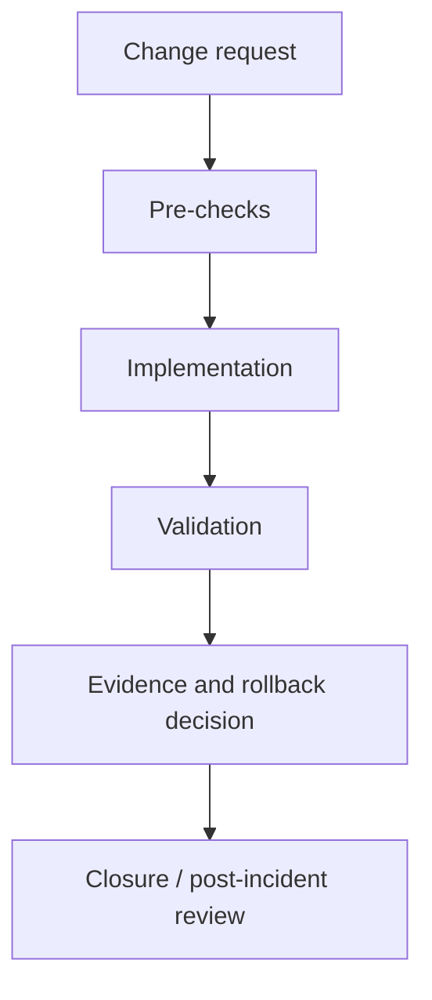

# Seppmail-Operations-Runbooks

> Standard operating procedures, recovery playbooks and change windows for SEPPmail implementations and adjacent platforms.

This repository is curated by Synedat Group GmbH for the SEPPmail ecosystem. It is intended as an implementation accelerator for customers, partners and delivery teams.

## Why this repository exists

This repository is designed to be immediately useful in workshops, pilots, production preparation and knowledge transfer. It combines upstream material with additional operational context, safer examples and governance-oriented documentation so that teams can move from an interesting script to a reviewable implementation asset.

## Intended audience

Operations, on-call and service transition teams.

## What you will find here

- `docs/ARCHITECTURE.md` - component view and trust boundaries
- `docs/RBAC-AND-PERMISSIONS.md` - practical role separation guidance
- `docs/SECURITY-AND-COMPLIANCE.md` - implementation mapping for ISO 27001, BAIT, DORA, TISAX and NIS2
- `docs/OPERATIONS.md` - operational lifecycle and evidence ideas
- `docs/TROUBLESHOOTING.md` - first-line support guidance
- `docs/SEPPMAIL-REFERENCES.md` - official reference list
- `docs/images/architecture-overview.svg` - lightweight architecture visual
- `runbooks/mail-flow-incident.md`
- `runbooks/certificate-rollover.md`
- `runbooks/disaster-recovery-exercise.md`

## Architecture at a glance

## Practical focus

- usable examples rather than empty scaffolding
- security-conscious defaults and notes on secrets handling
- architecture and permissions thinking, not just commands
- audit-friendly documentation structure
- consistent Synedat branding and discoverability across repositories

## Security and governance themes

This repository intentionally includes implementation notes that align well with:
- ISO/IEC 27001 style ISMS and control evidence
- BAIT expectations for banking IT governance and operations
- DORA-oriented operational resilience thinking
- TISAX-oriented supplier and security process maturity
- NIS2-style cyber hygiene and incident preparedness

## Official SEPPmail references

- [High availability cluster](https://docs.seppmail.com/en/04_com_09_cl_02_high-availability-cluster.html)
- [High availability and load balancing](https://docs.seppmail.com/en/03_wp_03_sa_06_ha__high-availability-loadbalancing.html)
- [API functions overview](https://docs.seppmail.com/en/09_ht_admin_api-functions.html)

## Synedat

Synedat Group GmbH works across software engineering, cloud, infrastructure, operations and security-related implementation projects. These repositories are structured to be useful both as public technical starters and as conversation starters for concrete customer delivery.

Website: https://www.synedat.com/

## Upstream and provenance

Where an original SEPPmail community repository was available, its source files were preserved and extended. Original README content, where replaced, was moved to `docs/upstream/ORIGINAL-README.md` for traceability.
