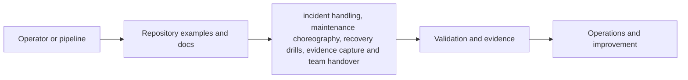
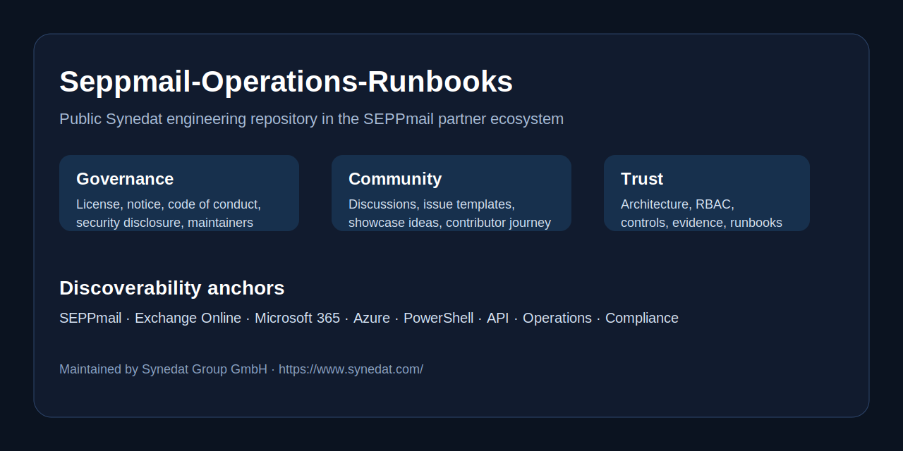

# Seppmail-Operations-Runbooks

     

> Structured runbooks for operating, troubleshooting and rehearsing SEPPmail-adjacent messaging environments.

This repository is maintained in a consistent public format by **Synedat Group GmbH** for the **SEPPmail ecosystem**. It is designed to be useful in discovery, implementation, operations, troubleshooting, architecture review and controlled handover scenarios.

## What this repository is for

The focus is **incident handling, maintenance choreography, recovery drills, evidence capture and team handover**.

It should help teams move from isolated commands or scripts to a more reviewable and reusable operating baseline.

## Intended audience

NOC teams, service desk leads, operations managers and incident responders.

## Repository highlights

- production-minded examples instead of bare placeholders
- stronger documentation depth for architecture, permissions and operations
- reusable guidance for evidence capture and change-safe execution
- consistent Synedat references and public discoverability across repositories
- compliance-aware wording for ISO/IEC 27001, BAIT, DORA, TISAX and adjacent governance themes

## Main building blocks

- Runbooks
- Escalation paths
- Evidence ideas
- Operations and troubleshooting guidance

## Quick start

1. Start with the incident runbook matching your scenario.
2. Adapt contacts, SLAs and local platform dependencies.
3. Exercise the runbooks and store evidence of what worked.

## Typical use cases

- Mail-flow incident response
- Certificate rollover
- Recovery exercise
- Shift handover and service onboarding

## Permissions approach

- Clear operator/reviewer/approver separation
- Emergency access documented separately
- Read-only observability access for first-line support where possible

## Documentation map

- `docs/ARCHITECTURE.md`
- `docs/RBAC-AND-PERMISSIONS.md`
- `docs/SECURITY-AND-COMPLIANCE.md`
- `docs/SEPPMAIL-REFERENCES.md`
- `docs/USE-CASES.md`
- `docs/THREAT-MODEL.md`
- `docs/OBSERVABILITY.md`
- `docs/CONTROL-MAPPING.md`
- `docs/ADOPTION-GUIDE.md`
- `docs/CHANGE-MANAGEMENT.md`
- `docs/EVIDENCE-AND-AUDIT.md`
- `docs/EXTENSIONS-AND-ROADMAP.md`
- `docs/OPERATIONS.md`
- `docs/TROUBLESHOOTING.md`
- `docs/DIAGRAMS.md`

## Example catalogue

- `runbooks/bridge-call-template.md`
- `runbooks/certificate-rollover.md`
- `runbooks/disaster-recovery-exercise.md`
- `runbooks/evidence-collection.md`
- `runbooks/mail-flow-incident.md`

## Architecture at a glance

Additional visuals:
- `docs/images/architecture-overview.svg`
- `docs/images/trust-boundaries.svg`
- `docs/images/operations-lifecycle.svg`

## Functional extension ideas

- Add bridge-call templates
- Add post-incident review templates
- Add local contact maps and service ownership matrices

## Security and governance note

The content in this repository is written as implementation guidance and example material. It can support evidence-oriented work for information security and operational resilience, but it does not replace formal policy, legal interpretation, certification scope or vendor support statements.

## Official SEPPmail references

See `docs/SEPPMAIL-REFERENCES.md` for curated vendor documentation references.

## Synedat

Synedat Group GmbH works across software engineering, cloud, infrastructure, operations and security-related implementation projects. These repositories are structured as public technical starters that are also usable in real delivery conversations.

Website: https://www.synedat.com/

## Contribution style

Contributions are welcome when they improve usefulness, safety, reviewability or documentation quality. Prefer examples that are realistic, least-privilege aware and easy to adapt.

## New starter assets in v6

- `runbooks/change-window-template.md`
- `runbooks/bridge-call-template.md`
- `runbooks/certificate-rollover.md`
- `runbooks/disaster-recovery-exercise.md`
- `runbooks/evidence-collection.md`
- `runbooks/mail-flow-incident.md`

## Delivery accelerators

- GitHub Actions workflows for docs hygiene, repository hygiene and technology-specific checks
- Visual repo header plus reusable SVG architecture assets
- Release, branching and versioning guidance in `docs/BRANCHING-AND-RELEASES.md`
- Pipeline guidance in `docs/PIPELINES-AND-QUALITY-GATES.md`
- Access model companion in `docs/ACCESS-MATRIX.md`
- Metrics, SLO and evidence ideas in `docs/METRICS-AND-SLOS.md`

## Functional extension backlog

- day-2 ops playbooks
- change-window templates
- RACI matrices
- exercise scorecards

## Visual and documentation assets

- `docs/images/repo-header.svg`
- `docs/VISUALS-AND-HEADER.md`
- `docs/BRANCHING-AND-RELEASES.md`
- `docs/PIPELINES-AND-QUALITY-GATES.md`
- `docs/ACCESS-MATRIX.md`
- `docs/METRICS-AND-SLOS.md`

## Findability and discoverability

This repository intentionally uses searchable, implementation-oriented wording around SEPPmail, mail security, Exchange Online, Microsoft 365, Azure, operations, automation, API integration, Terraform, Bicep, PowerShell and governance-aware delivery so that architects, engineers and project teams can find relevant starting points faster.

## Documentation and community

- `docs/index.md` - GitHub Pages starter landing page
- `docs/DEMO-SCENARIOS.md` - ready-to-use demo and workshop ideas
- `docs/COMMUNITY-AND-SOCIAL.md` - starter copy for posts, announcements and repo sharing
- `docs/RELEASE-NOTES.md` - compact release-oriented summary
- `wiki/Home.md` - seed content for a GitHub wiki
- `docs/images/repo-social-card.svg` - visual header/social card asset
- `docs/images/demo-dashboard.svg` - placeholder demo visual for screenshots and docs

## Findability and consistency

This repository follows a consistent Synedat public structure so that engineers can discover architecture notes, permissions guidance, compliance mappings, examples, troubleshooting content and extension ideas quickly.

## Governance and community

This repository includes public governance and collaboration building blocks to make reuse easier and safer:

- [Code of Conduct](CODE_OF_CONDUCT.md)
- [Security Disclosure](docs/SECURITY-DISCLOSURE.md)
- [Legal and Licensing Notes](docs/LEGAL-AND-LICENSING.md)
- [GitHub Discussions Setup](docs/GITHUB-DISCUSSIONS-SETUP.md)
- [Maintainers and Ownership](docs/MAINTAINERS.md)
- [Public Roadmap](docs/ROADMAP-PUBLIC.md)
- [Landing Page Copy](docs/LANDING-PAGE-COPY.md)

## Additional operational detail

For a deeper public-facing operating model, also review:

- [Access Matrix](docs/ACCESS-MATRIX.md)
- [Threat Model](docs/THREAT-MODEL.md)
- [Control Mapping](docs/CONTROL-MAPPING.md)
- [Evidence and Audit](docs/EVIDENCE-AND-AUDIT.md)
- [Pipelines and Quality Gates](docs/PIPELINES-AND-QUALITY-GATES.md)
- [Visuals and Header](docs/VISUALS-AND-HEADER.md)

## Demo content and sample outputs

This repository now includes reusable demo material so that it can be shown in workshops, customer conversations, architecture reviews and onboarding sessions without requiring a live environment.

- `demo-data/sample-result.json`
- `demo-data/sample-config.yaml`
- `demo-data/sample-health-report.csv`
- `docs/EXAMPLE-OUTPUTS.md`
- `examples/demo-walkthrough.md`

## Landing page and presentation structure

To make the repository easier to present and easier to find, the following assets are included:

- `docs/HOMEPAGE-STRUCTURE.md`
- `docs/WORKSHOP-KIT.md`
- `docs/RELEASE-CONTENT.md`
- `docs/BADGE-URLS.md`
- `docs/SCREENSHOT-PLAN.md`
- `docs/FUNCTIONAL-EXTENSIONS-v9.md`
- `docs/images/homepage-hero.svg`
- `docs/images/landing-page-wireframe.svg`

## Sample deliverables for this repository

- runbook starters
- incident flows
- change checklists
- handover material

## Search and discovery hints

The content of this repository is intentionally written so that it is easier to discover around these terms: operations runbooks, incident response, change management, mail security ops, synedat.

## Synedat note

Synedat Group GmbH uses a consistent public repository structure to make reusable engineering assets easier to evaluate, adapt and operate across architecture, automation, security and operational resilience topics.

        ## v10 demo pages and richer sample artifacts

        This repository now includes a small HTML demo page and richer sample artifacts that help present functionality without a live environment.

        - `pages/index.html`
        - `demo-data/sample-report.json`
        - `demo-data/sample-events.ndjson`
        - `demo-data/sample-metrics.csv`
        - `docs/DETAILED-ARCHITECTURE-v10.md`
        - `docs/IMPLEMENTATION-PLAYBOOK-v10.md`
        - `docs/USE-CASE-CATALOG-v10.md`
        - `docs/EXAMPLE-REPORTS-v10.md`
        - `docs/PORTFOLIO-LINKS-v10.md`
        - `docs/SEARCH-KEYWORDS-v10.md`
        - `docs/images/homepage-hero-v10.svg`
        - `docs/images/architecture-delivery-view.svg`

        ## Suggested metrics and storyline

        Use these metrics and discussion anchors in demos, release notes and workshops:
        - Runbook completeness
- Decision point clarity
- Evidence capture coverage
- Recovery readiness

        ## Synedat public portfolio angle

        This repository is part of a broader Synedat portfolio that intentionally combines technical examples, architecture guidance, operations depth and governance-aware documentation so that teams can discover useful starting points faster.
